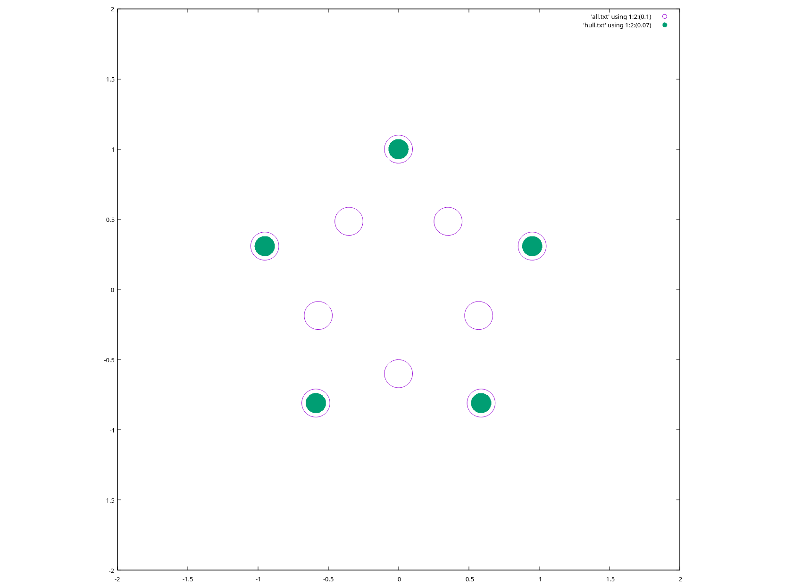

# `07012`

## Interactive

Below are some Haskell snippets that are useful for evaluating:

```haskell
-- five pointed star for testing
ctns = [Ctn (sin r * ell) (cos r * ell) | (ell, r) <- zip a b] where 
    a = cycle [1, 0.6]
    b = map (radians . (*) 36 ) [0,1..9]
    radians = (*) (2 * pi / 360)
```

```haskell
-- print a list of cartesian coodinates
printCtns :: [Ctn] -> IO ()
printCtns ctns = putStr $ "[\n" <> f ctns <> "]\n" where
    f = unlines . map ((<>) ", ") . map show
```

```haskell
-- print a list of triplets
printTriplets :: [Triplet] -> IO ()
printTriplets triplets = putStr $ "[\n" <> f triplets <> "]\n" where
    f = unlines . map ((<>) ", ") . map show
```

```haskell
-- convert radians to degrees
degrees = (*) (360 / 2 / pi)
```

```haskell
-- convert degrees to radians
radians = (*) (2 * pi / 360)
```

```haskell
-- assign each cartesian point its own identifier
[a,b,c,d,e,f,g,h,i,j,a'] = ctns
```

```haskell
-- retrieve a tuple of x and y from a Ctn 
unctn (Ctn x y) = (x,y)
```

```haskell
-- print a list of Ctn in a format that gnuplot understands
toGnuplot :: [Ctn] -> IO ()
toGnuplot xs = putStr $ unlines $ map f xs where
    f = \(Ctn x y) -> (show x) <> " " <> (show y)
```

```console
$ ghci
```
```haskell
GHCi, version 9.4.7: https://www.haskell.org/ghc/  :? for help
λ :load graham-scan.hs 
[1 of 1] Compiling GrahamScan       ( graham-scan.hs, interpreted )
Ok, one module loaded.
λ :{
┣ -- print a list of cartesian coodinates
┣ printCtns :: [Ctn] -> IO ()
┣ printCtns ctns = putStr $ "[\n" <> f ctns <> "]\n" where
┣     f = unlines . map ((<>) ", ") . map show
┣ :}
λ :{
┣ -- five pointed star for testing
┣ ctns = [Ctn (sin r * ell) (cos r * ell) | (ell, r) <- zip a b] where 
┣     a = cycle [1, 0.6]
┣     b = map (radians . (*) 36 ) [0,1..9]
┣     radians = (*) (2 * pi / 360)
┣ :}
λ printCtns ctns 
[
, Ctn 0.0 1.0
, Ctn 0.3526711513754839 0.4854101966249684
, Ctn 0.9510565162951535 0.30901699437494745
, Ctn 0.5706339097770922 (-0.1854101966249684)
, Ctn 0.5877852522924732 (-0.8090169943749473)
, Ctn 7.347880794884119e-17 (-0.6)
, Ctn (-0.587785252292473) (-0.8090169943749476)
, Ctn (-0.570633909777092) (-0.18541019662496852)
, Ctn (-0.9510565162951536) 0.30901699437494723
, Ctn (-0.352671151375484) 0.48541019662496837
]
λ :{
┣ toGnuplot :: [Ctn] -> IO ()
┣ toGnuplot xs = putStr $ unlines $ map f xs where
┣     f = \(Ctn x y) -> (show x) <> " " <> (show y)
┣ :}
λ toGnuplot ctns
0.0 1.0
0.3526711513754839 0.4854101966249684
0.9510565162951535 0.30901699437494745
0.5706339097770922 -0.1854101966249684
0.5877852522924732 -0.8090169943749473
7.347880794884119e-17 -0.6
-0.587785252292473 -0.8090169943749476
-0.570633909777092 -0.18541019662496852
-0.9510565162951536 0.30901699437494723
-0.352671151375484 0.48541019662496837
λ printCtns $ hull $ ctns
[
, Ctn (-0.587785252292473) (-0.8090169943749476)
, Ctn 0.5877852522924732 (-0.8090169943749473)
, Ctn 0.9510565162951535 0.30901699437494745
, Ctn 0.0 1.0
, Ctn (-0.9510565162951536) 0.30901699437494723
, Ctn (-0.587785252292473) (-0.8090169943749476)
]
λ toGnuplot $ hull $ ctns
-0.587785252292473 -0.8090169943749476
0.5877852522924732 -0.8090169943749473
0.9510565162951535 0.30901699437494745
0.0 1.0
-0.9510565162951536 0.30901699437494723
-0.587785252292473 -0.8090169943749476
```

Some gnuplot code to visualize

```
$ gnuplot
gnuplot> set xrange [-2:2]
gnuplot> set yrange [-2:2]
gnuplot> set size ratio -1
gnuplot> plot 'all.txt' using 1:2:(0.1) with circles, 'hull.txt' using 1:2:(0.07) with circles fill solid noborder
```

Should result in:



## Linting

```console
hlint grahams-scan.hs
```

